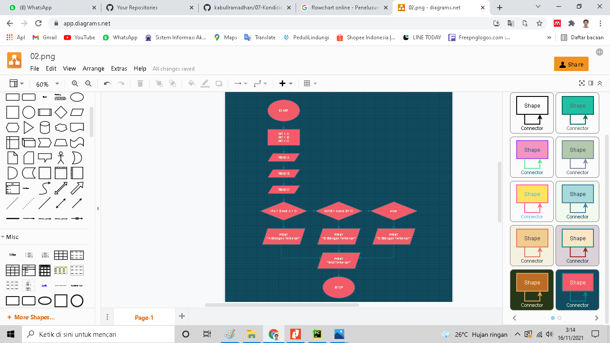
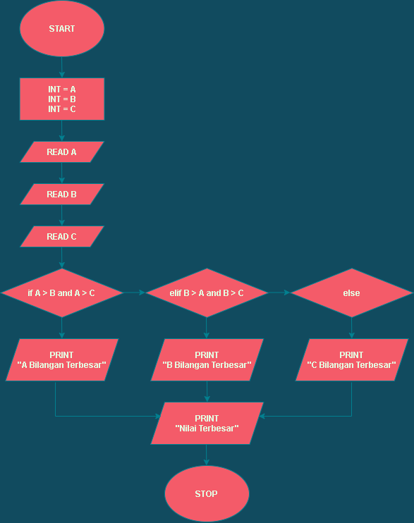
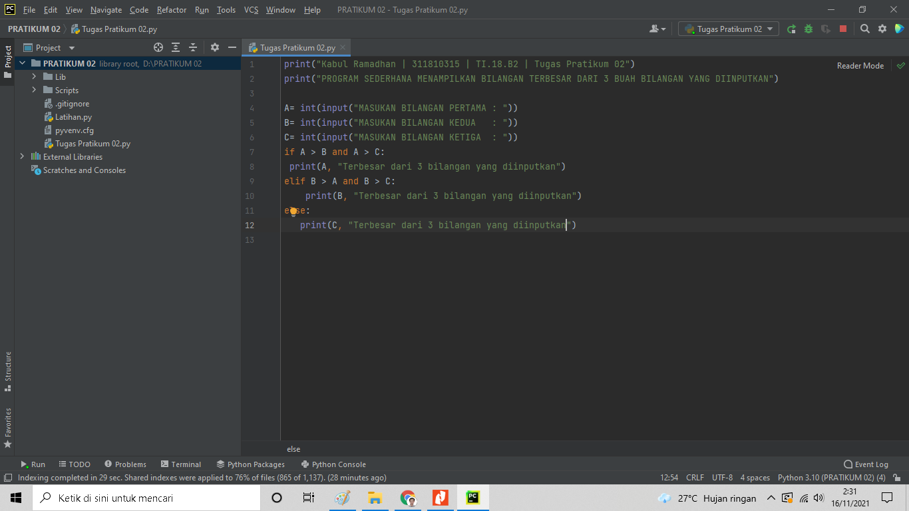
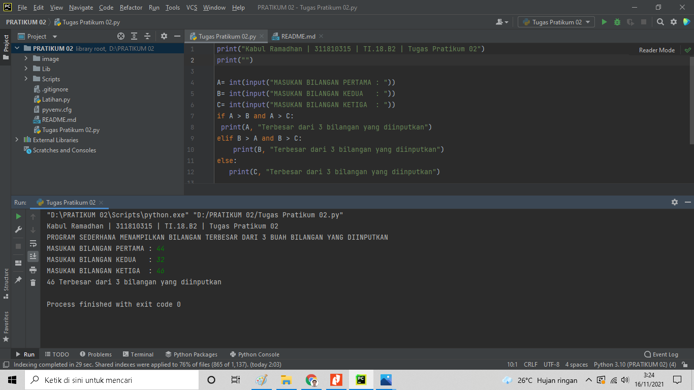

# TUGAS PRATIKUM 02

Kabul Ramadhan | 311810315 | TI.18.B2 | Bahasa Pemrograman

#PRATIKUM02
## Membuat Program Sederhana Menampilkan Bilangan Terbesar Dari 3 Buah Bilangan Yang Diinputkan
***

### Penjelasan

1. Untuk mencari bilangan terbesar dari 3 bilangan algoritmanya yang dimasukkan akan membandingkan terlebih dahulu
 apakah a>b.

2. Jika a>b,maka ada 2  kadidat bilangan terbesar,yaitu a dan c sehingga perlu dilakukan pengujian yang manakah
 dari a dan c yang lebih besar dengan melakukan membandingkan nilai b dan c. jika nilai b ternyata lebih besar dari c,
 maka bilangan terbesar adalah a.nilai terbesar adalah c jika ternyata c lebih besar dari dari a.

3. Jika kondisi a>b tidak terpenuhui(atau b<=a),maka 2 kadidat bilangan terbesar  adalah b dan c.jika nilai c ternyata 
 lebih kecil dari a,maka b adalah nilai terbesar,sedangakan jika c yang lebih besar dari b,maka yang terbesar adalah c.

### Flowchart

### Struktur Algoritma
1. Start
2. Gunakaan inisial a,b,c sebagai intenjer.
3. Read a
4. Read b
5. Read c
6. if a>b and a<c:
7. Cetak "a terbesar dari bilangan yang diinputkan"
8. elif b>a and b>c:
9. Cetak "b terbesar dari bilangan yang diinputkan"
10. else
11. Cetak "c terbesar dari bilangan yang diiinputkan"
12. Cetak " nilai terbesar yang diinputkan"
13. Stop

### Code Program

### Hasil Program

